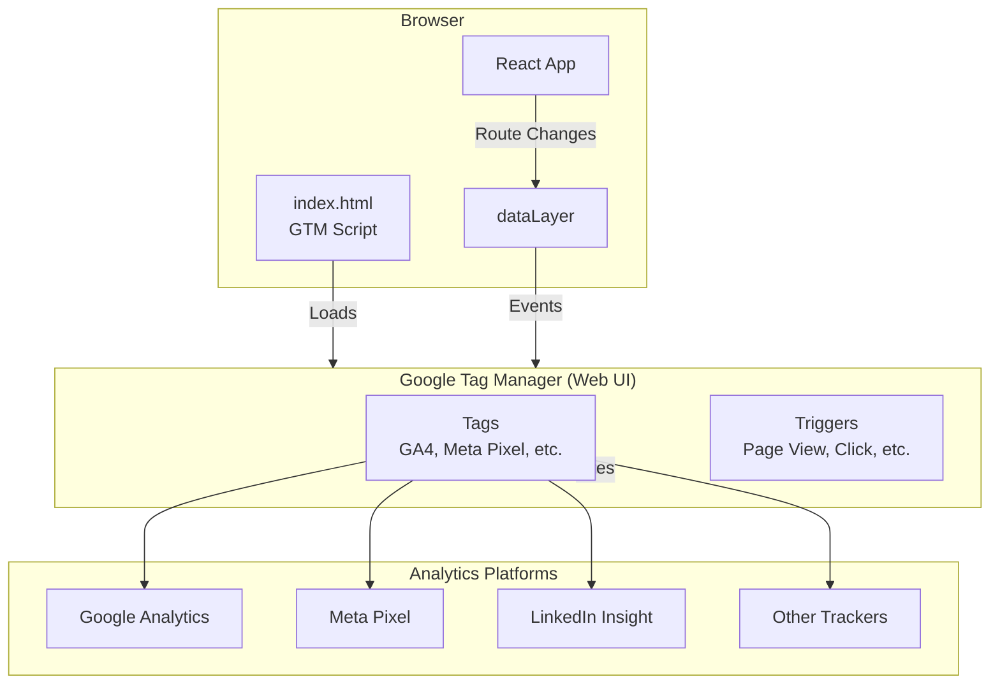

# Analytics & Tracking Setup

This document covers how analytics and tracking are implemented in the VibeOps site.

## Architecture



## How It Works

1. **GTM Script** loads in `index.html` on page load
2. **React Router** detects route changes
3. **usePageTracking hook** pushes `page_view` events to `dataLayer`
4. **GTM** picks up events and fires configured tags
5. **Analytics platforms** receive the data

## Design Decisions

| Decision | Rationale |
|----------|-----------|
| GTM over direct GA | Marketing can add/remove trackers without code changes |
| Single tracking hook | Modular, reusable, follows React patterns |
| vite-plugin-html-env | Standard approach for injecting env vars into HTML |
| dataLayer push pattern | GTM-recommended, works with all tag types |
| Environment variables | Different GTM containers for dev/staging/prod |

---

## Developer Setup

### Environment Variables

Add to `.env` file:

```bash
VITE_GTM_ID=GTM-XXXXXXX
```

Get GTM container ID from [Google Tag Manager](https://tagmanager.google.com).

### Local Testing

1. Set `VITE_GTM_ID` in `.env` file
2. Run `npm run dev`
3. Open GTM Preview mode in browser
4. Navigate between pages and verify events fire

### Build Verification

```bash
npm run build
grep "GTM-" dist/index.html  # Should show GTM ID
```

---

## Vercel Configuration

1. Go to **Vercel Dashboard** → **Project** → **Settings** → **Environment Variables**
2. Add: `VITE_GTM_ID` = `GTM-XXXXXXX`
3. Apply to desired environments:
   - **Production**: Main GTM container
   - **Preview**: A separate testing container (optional)

---

## Marketing Team Guide

### What You Can Do (No Code Required)

Once GTM is deployed, you can add these via the [GTM web interface](https://tagmanager.google.com):

- **Google Analytics 4 (GA4)** - Page views, events, conversions
- **Facebook/Meta Pixel** - Retargeting, conversion tracking
- **LinkedIn Insight Tag** - B2B audience tracking
- **Twitter/X Pixel** - Ad conversion tracking
- **TikTok Pixel** - Campaign tracking
- **Hotjar/FullStory** - Session recording, heatmaps
- **Custom HTML/JS** - Any other tracking scripts

### Setting Up Google Analytics 4

1. Create a GA4 property at [analytics.google.com](https://analytics.google.com)
2. Copy Measurement ID (e.g., `G-XXXXXXXXXX`)
3. In GTM:
   - Create a new **GA4 Configuration** tag
   - Enter Measurement ID
   - Set trigger to **All Pages**
   - Publish

### Creating Custom Triggers

GTM automatically receives these events from the site:

| Event | Description |
|-------|-------------|
| `page_view` | Fires on every route change |
| `page_path` | The current URL path |
| `page_title` | The current page title |

You can create triggers based on:
- Specific page paths (e.g., `/contact`, `/reportly`)
- Page title contains certain text
- Custom dataLayer events (requires developer help)

---

## Troubleshooting

### GTM Not Loading

1. Check browser console for errors
2. Verify `VITE_GTM_ID` is set in environment
3. Check Network tab for `gtm.js` request

### Events Not Firing

1. Use GTM Preview mode to debug
2. Check browser console for `dataLayer` array
3. Verify route changes trigger the `page_view` event

### Different Container for Preview vs Production

Set different `VITE_GTM_ID` values per environment in Vercel:
- Production: `GTM-PROD123`
- Preview: `GTM-TEST456`

---

## Files Reference

| File | Purpose |
|------|---------|
| `index.html` | GTM script tags |
| `src/hooks/usePageTracking.ts` | Route change tracking |
| `src/App.tsx` | PageTracker component integration |
| `vite.config.ts` | HTML env variable injection |
| `.env.example` | Environment variable template |
