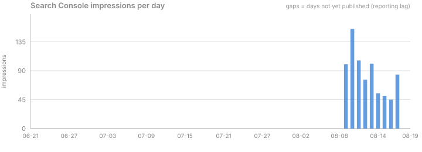
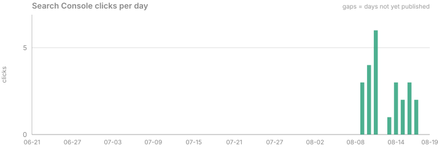
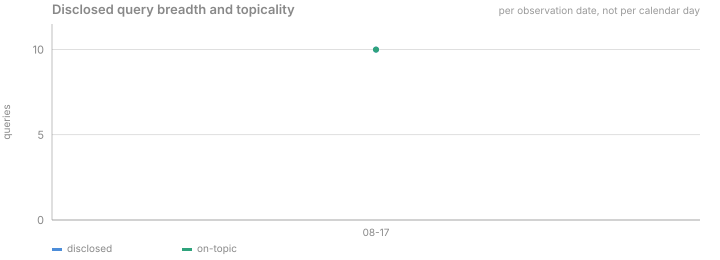
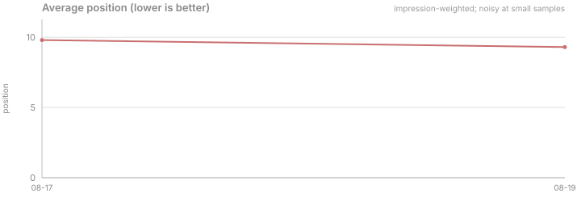
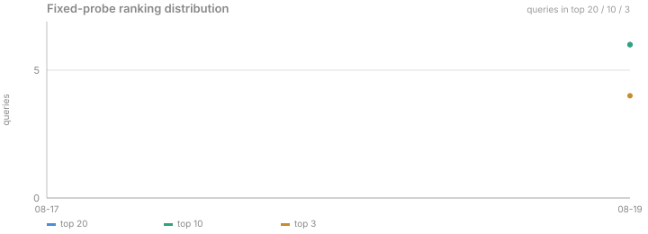

# SEO trend charts

Generated by `scripts/seo/charts.mjs` from `docs/seo/data/history.json`.
Regenerated wholesale on each run — do not hand-edit. Static SVG, no dependencies,
no hosted analytics.

Generated: 2026-08-19T23:50:35.905Z

> Charts sourced from Search Console and from web analytics represent **different
> windows**. Do not read across them as if they shared a timeline.

### Search Console impressions per day

_gaps = days not yet published (reporting lag)_

### Search Console clicks per day

_gaps = days not yet published_

### Web analytics pageviews per day

_No data yet._

### Search-referred human pageloads — the organic traffic KPI

_No data yet._

### Search-referred pageloads by engine

_No data yet._

### Human pageloads by acquisition channel

_No data yet._

### Disclosed query breadth and topicality

_per observation date, not per calendar day_

### Average position (lower is better)

_impression-weighted; noisy at small samples_

### Cumulative impressions by cluster

_No data yet._

### Fixed-probe ranking distribution

_queries in top 20 / 10 / 3_
